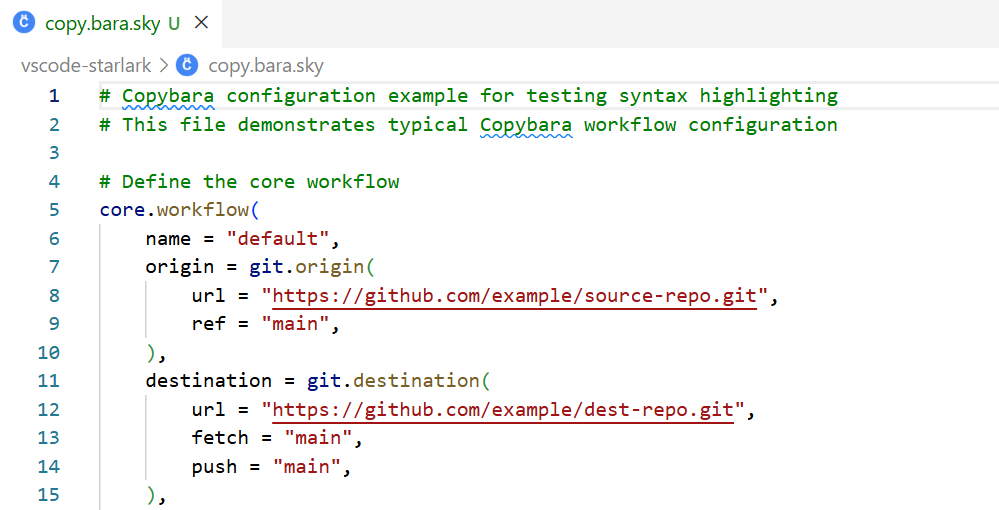

# vscode-copybara

VSCode extension for [Copybara](https://github.com/google/copybara) - A tool for transforming and moving code between repositories.

This extension provides syntax highlighting, code snippets, and IntelliSense support for Copybara configuration files (`.sky` files).

## Features

- **Syntax highlighting** for Copybara `.sky` files
- **IntelliSense support** with code snippets for common Copybara configurations
- **Auto-completion** for Copybara API functions and modules:
  - `core.*` - Core workflow and transformation functions
  - `git.*` - Git origin and destination configurations
  - `metadata.*` - Commit message and author manipulation
  - `authoring.*` - Author mapping strategies
  - `patch.*`, `buildozer.*`, and more
- **Quick templates** for workflows, transformations, and migrations
- Based on Starlark language syntax:
  - Comments (`#`)
  - Bracket matching and auto-closing
  - String and numeric literals
  - Function definitions and calls



## Installation

1. Install from VSCode Marketplace search for "Copybara")
   [vscode-copybara](https://marketplace.visualstudio.com/items?itemName=WindLi.vscode-copybara)
3. Or install from VSIX file
4. Open any `.sky` file to activate the extension

## Supported File Types

- `.sky` - Copybara configuration files
- `copy.bara.sky` - Standard Copybara configuration file name

## Usage

### Code Snippets

The extension provides code snippets for quick Copybara configuration. Start typing and select from the suggestions:

- `core.workflow` - Create a complete workflow
- `git.origin` - Define a Git origin
- `git.destination` - Define a Git destination
- `core.replace` - Replace text transformation
- `core.move` - Move files transformation
- `metadata.squash_notes` - Squash commit messages
- `authoring.pass_thru` - Pass-through authoring
- And many more...

### Example

Create a new `copy.bara.sky` file and start typing `core.workflow`, then press Tab to insert a complete workflow template:

```copybara
core.workflow(
    name = "default",
    origin = git.origin(
        url = "https://github.com/example/source.git",
        ref = "main",
    ),
    destination = git.destination(
        url = "https://github.com/example/dest.git",
        fetch = "main",
        push = "main",
    ),
    transformations = [
        core.move("src/", ""),
    ],
    authoring = authoring.pass_thru(default = "Copybara <copybara@example.com>"),
    mode = "SQUASH",
)
```

## Resources

- [Copybara Official Documentation](https://github.com/google/copybara)
- [Copybara Reference Guide](https://github.com/google/copybara/blob/master/docs/reference.md)
- [Example Configurations](https://github.com/google/copybara/tree/master/docs/examples.md)
- [vscode-copybara](https://marketplace.visualstudio.com/items?itemName=WindLi.vscode-copybara)
## Contributing

Contributions are welcome! Please feel free to submit a Pull Request.

## License

Apache-2.0
